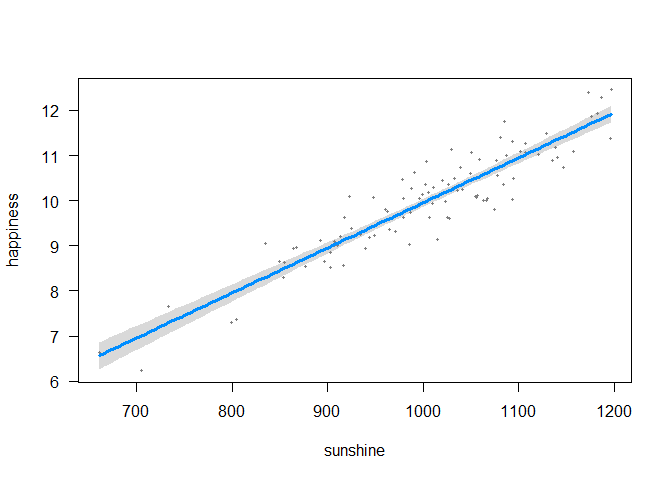

Does sunshine make people happy?
================
F. Sanchez-Rodriguez
Thursday, 17 November 2016

Introduction
------------

It is well known that individual well-being can be influenced by climatic conditions. However, ...

Methods
-------

We collected data on 99 individuals and fitted a linear model.

Results
-------

We found that...

|             |    Estimate|  Std. Error|   t value|  Pr(&gt;|t|)|
|-------------|-----------:|-----------:|---------:|------------:|
| (Intercept) |  -0.0366031|   0.4240401|  -0.08632|      0.93139|
| sunshine    |   0.0099875|   0.0004210|  23.72372|      0.00000|



Discussion
----------

These results confirm that sunshine is good for happiness (slope = 0.0099875).

Acknowledgements
----------------

Y. Xie, J. MacFarlane, Rstudio...

References
----------

\[@Peng\_2016\]

``` r
sessionInfo()
```

    ## R version 3.4.3 (2017-11-30)
    ## Platform: i386-w64-mingw32/i386 (32-bit)
    ## Running under: Windows 7 (build 7601) Service Pack 1
    ## 
    ## Matrix products: default
    ## 
    ## locale:
    ## [1] LC_COLLATE=Spanish_Spain.1252  LC_CTYPE=Spanish_Spain.1252   
    ## [3] LC_MONETARY=Spanish_Spain.1252 LC_NUMERIC=C                  
    ## [5] LC_TIME=Spanish_Spain.1252    
    ## 
    ## attached base packages:
    ## [1] stats     graphics  grDevices utils     datasets  methods   base     
    ## 
    ## other attached packages:
    ## [1] visreg_2.5-0 knitr_1.20   xtable_1.8-2
    ## 
    ## loaded via a namespace (and not attached):
    ##  [1] Rcpp_0.12.15    lattice_0.20-35 digest_0.6.15   rprojroot_1.3-2
    ##  [5] grid_3.4.3      backports_1.1.2 magrittr_1.5    evaluate_0.10.1
    ##  [9] highr_0.6       stringi_1.1.6   rmarkdown_1.9   tools_3.4.3    
    ## [13] stringr_1.3.0   yaml_2.1.18     compiler_3.4.3  htmltools_0.3.6
